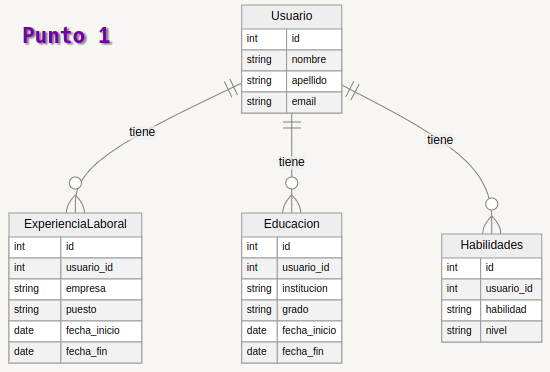

## Punto 1




```json
{
    "Usuario": [
        {
            "usuario_id": 1,
            "nombre": "Cristian",
            "apellido": "Carpeta",
            "email": "Cristian@1234.com",
            "experiencia_laboral": [
                {
                    "id": 1,
                    "usuario_id": 1,
                    "empresa": "zapaton",
                    "puesto": "operario",
                    "fecha_inicio": "03/04/2000",
                    "fecha_fin": "05/04/2002"
                }
            ],
            "educación": [
                {
                    "id": 1,
                    "usuario_id": 1,
                    "institucion": "los pollitos",
                    "grado": "bachillerato",
                    "fecha_inicio": "06/04/1980",
                    "fecha_fin": "12/03/1999"
                }
            ],
            "habilidades": [
                {
                    "id": 1,
                    "usuario_id": 1,
                    "habilidad": "cortar",
                    "nivel": "basico"
                }
            ]
        }
    ]
}


```


