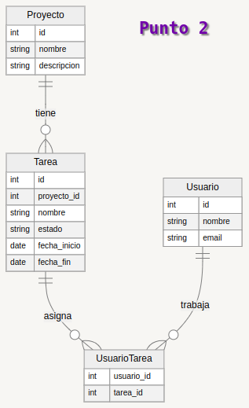

## Punto 2



```json
{
    "proyecto": [
        {
            "id": 1,
            "nombre": "puente",
            "descripcion": "hacer un puente elevadizo",
            "tareas": [
                {
                    "id": 1,
                    "proyecto_id": 1,
                    "nombre": "comprar material",
                    "estado": "activo",
                    "fecha_inicio": "12 ago 2014",
                    "fecha_fin": "12 ago 2016"
                },
                {
                    "id": 2,
                    "proyecto_id": 1,
                    "nombre": "contratar personal",
                    "estado": "activo",
                    "fecha_inicio": "12 ago 2014",
                    "fecha_fin": "12 dic 2016"
                }
            ],
            "usuarios_tareas": [
                {
                    "usuario_id": 1,
                    "tarea_id": 1
                },
                {
                    "usuario_id": 2,
                    "tarea_id": 2
                }
            ],
            "usuarios": [
                {
                    "usuario_trabaja_id": 1,
                    "nombre": "Jesus Restrepo",
                    "email": "jesusr@gmail.com"
                },
                {
                    "usuario_trabaja_id": 2,
                    "nombre": "Nubia Velandia",
                    "email": "nubiav@hotmail.com"
                }
            ]
        }
    ]
}


            

           


```
