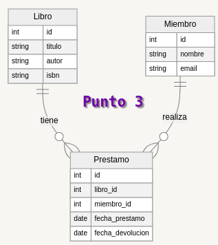

## Punto 3



```json
{
    "Libros": [
        {
            "libro_id": 1,
            "titulo": "En pie de guerra",
            "autor": "Carlos Cuauhtémoc Sánchez",
            "isbn": "123-123-123"
        },
        {
            "libro_id": 2,
            "titulo": "100 años de soledad",
            "autor": "Gabriel G. Marquez",
            "isbn": "246-684-123"
        },
        {
            "libro_id": 3,
            "titulo": "El principito",
            "autor": "Antoine de Saint-Exupéry",
            "isbn": "578-988-453"
        }
    ],
    "prestamos": [
        {
            "prestamo_id": 1,
            "libro_id": 1,
            "miembro_id": 1,
            "fecha_prestamo": "12 agos 2024",
            "fecha_devolucion": "15 agos 2014"
        },
        {
            "prestamo_id": 2,
            "libro_id": 2,
            "miembro_id": 2,
            "fecha_prestamo": "12 agos 2024",
            "fecha_devolucion": "15 agos 2014"
        },
        {
            "prestamo_id": 3,
            "libro_id": 3,
            "miembro_id": 3,
            "fecha_prestamo": "12 agos 2024",
            "fecha_devolucion": "15 agos 2014"
        }
    ],
    "miembros": [
        {
            "miembro_id": 1,
            "nombre": "Jesus Restrepo",
            "email": "jesusr@gmail.com"
        },
        {
            "miembro_id": 2,
            "nombre": "Nubia Velandia",
            "email": "nubiav@hotmail.com"
        },
        {
            "miembro_id": 3,
            "nombre": "Cristian Carpeta",
            "email": "Cristian@1234.com"
        }
    ]
}

            


```

