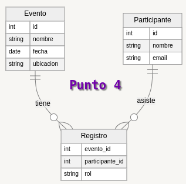

## Punto 4



```json
{
    "eventos": [
        {
            "id": 1,
            "nombre_evento": "matrimonio",
            "fecha": "22 enero 2024",
            "ubicacion_evento": "cartagena"
        },
        {
            "id": 2,
            "nombre_evento": "graduacion",
            "fecha": "10 diciembre 2024",
            "ubicacion_evento": "cali"
        }
    ],
    "registros": [
        {
            "id": 1,
            "participante_id": 2,
            "rol": "invitado"
        },
        {
            "id": 2,
            "participante_id": 1,
            "rol": "anfitrion"
        }
    ],
    "participantes": [
        {
            "participante_id": 2,
            "nombre": "Jesus Restrepo",
            "email": "jesusr@gmail.com"
        },
        {
            "participante_id": 1,
            "nombre": "Nubia Velandia",
            "email": "nubiav@hotmail.com"
        }
    ]
}


```