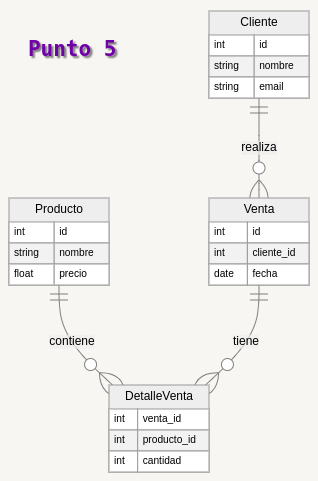

## Punto 5



```json
{
  "Cliente": [
    {
      "id": 01,
      "nombre": "Cristian",
      "email": "123@gmail.com"
    }
  ],
  "Producto": [
    {
      "id": 1,
      "nombre": "azucar",
      "precio": "1.000"
    }
  ],
  "Venta": [
    {
      "id": 3,
      "cliente_id": 01,
      "fecha": 22-03-02
    }
  ],
  "DetalleVenta": [
    {
      "venta_id": 3,
      "producto_id": 1 ,
      "cantidad": 5
    }
  ]
}


```
